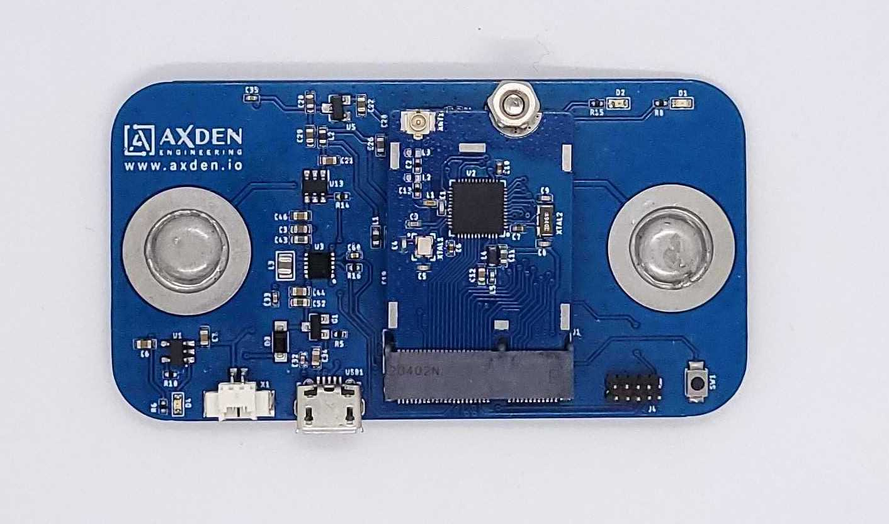
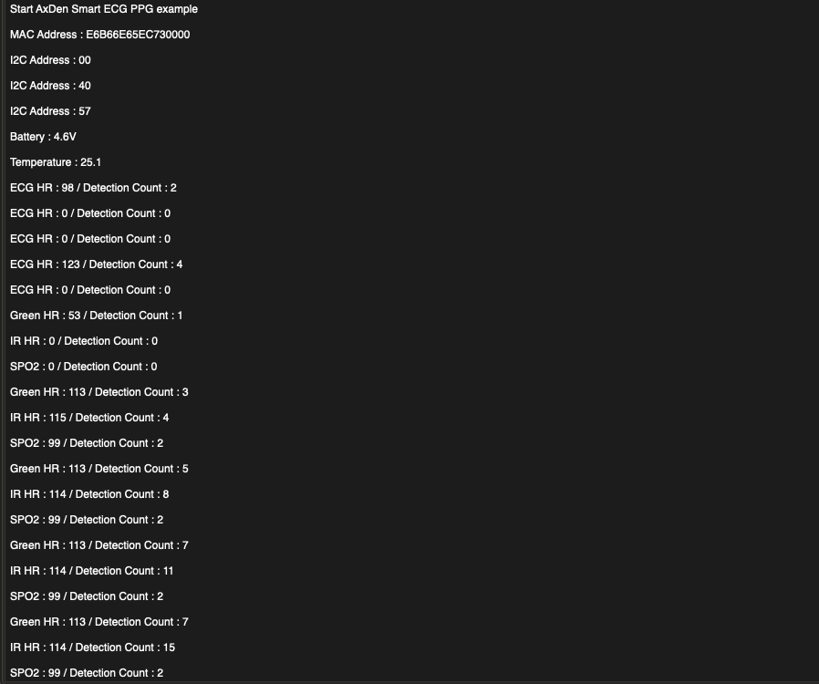
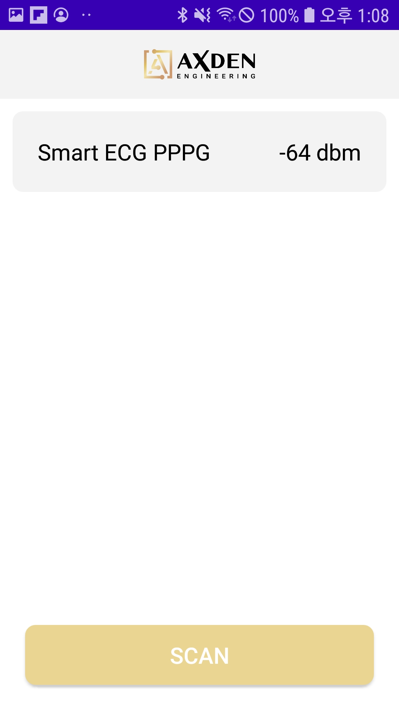
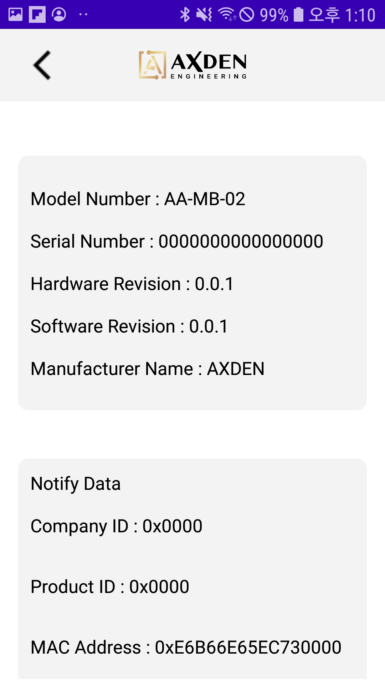
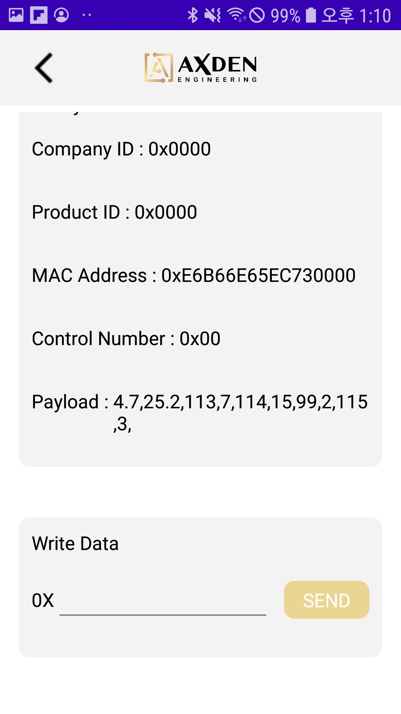
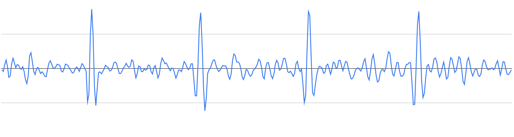
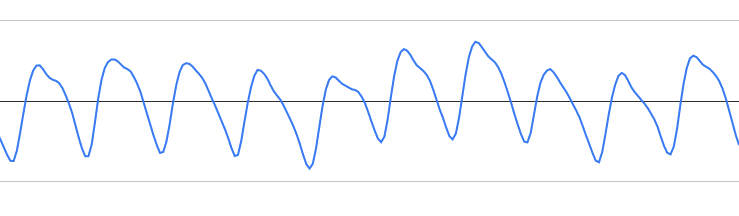

# NRF52832 Smart ECG PPG example

-------------------------

<table>
<tr align="center">
  <td> TOP </td>
</tr>
  <tr align="center">
    <td></td>
  </tr>
  <tr align="center">
    <td> BOTTOM </td>
  </tr>
    <tr align="center">
      <td></td>
    </tr>
</table>

-------------------------

Bluetooth Smart ECG PPG 은 AxDen 의 Aggregator Platform 를 이용하여 ECG(심전도), Heart rate(심박수), SPO2(산소포화도), 온도 와 같은 핵심적인 활력 징후(Vital Signs) 정보를 수집합니다.
 
Android, iOS, Aggregator 간의 통신이 필요한 다양한 서비스 시나리오를 빠르게 테스트 할 수 있도록 제공하는 예제입니다.
 
 
Bluetooth Smart ECG PPG collects key vital signs information such as ECG, heart rate, SPO2, and temperature using AxDen's Aggregator Platform.
 
This is an example provided to quickly test various service scenarios that require communication between Android, iOS, and Aggregator.
 

네이버 스마트 스토어에서 구매 가능합니다.
 

[네이버 스마트 스토어](https://smartstore.naver.com/axden)
 

-------------------------

### Bluetooth Smart ECG PPG 의 주요 특징 및 기능

MCU | 설명
:-------------------------:|:-------------------------:
NRF52832 | BLE 5.0 / 5.1 / 5.2 / 5.3

센서 | 설명
:-------------------------:|:-------------------------:
MAX30003 | ECG(심전도), Heart rate(심박수) sensor
MAX30101 | SPO2(산소포화도), Heart rate(심박수) sensor
SI7051 | Temperature sensor

*체온 측정이 필요한 경우 development@axden.io 로 문의 주시기 바랍니다.*

Bluetooth Smart ECG PPG 예제는 ECG(심전도), Heart rate(심박수), SPO2(산소포화도), 온도 와 같은 핵심적인 활력 징후(Vital Signs) 정보를 수집하고 Bluetooth 통신을 이용하여 Android, iOS, Aggregator 에 전송합니다.
 
 
AxDen Aggregator Platform 과 연동하여 서버, DB 와 같은 인프라 구축 없이 Web 과 Mobile 에서 센서 정보를 확인합니다.
 
 
AxDen Aggregator Platform 에 저장된 센서 정보를 이용하여 Edge AI 를 학습시킵니다.
 

-------------------------

### Terminal & Android Application
 

terminal baudrate : 9600
 

<table>
  <tr align="center">
    <td> Terminal </td>
  </tr>
  <tr align="center">
    <td></td>
  </tr>
</table>

<table>
  <tr align="center">
    <td> </td>
    <td> Android </td>
    <td> </td>
  </tr>
  <tr align="center">
    <td></td>
    <td></td>
    <td></td>
  </tr>
</table>

<table>
  <tr align="center">
    <td>ECG Graph</td>
  </tr>
  <tr align="center">
    <td></td>
  </tr>
</table>

<table>
  <tr align="center">
    <td>PPG Graph</td>
  </tr>
  <tr align="center">
    <td></td>
  </tr>
</table>

-------------------------

#### AxDen Aggregator Platform 을 이용한 확인 방법

AxDen Aggregator 홈페이지에서 회원 가입 후 Bluetooth Smart ECG PPG 의 MAC Address 를 등록합니다.
 
AxDen Aggregator 홈페이지에서 제공하는 COMPANY ID, DEVICE ID 를 Protocol.h 파일의 COMPANY_ID, DEVICE_ID 에 입력합니다.
 
 
`#define COMPANY_ID 0`
 
`#define DEVICE_TYPE 0`
 
 
컴파일 후 플래싱을 합니다.
 
 
터미널을 통해 COMPANY_ID, DEVICE_ID 가 정상적으로 적용되었는지 확인합니다.
 
 
센서 정보를 Web 또는 Mobile 에서 확인할 수 있습니다.
 

-------------------------

### Note
 

Works with SoftDevice S132 v7.2.0, provided with SDK 17.1.0.
 

To compile it, clone the repository in the [SDK]/examples/ble_peripheral folder.

-------------------------

### [SDK Download](https://github.com/AxDen-Dev/NRF52_Ping_pong_example)

-------------------------

### [Project import](https://github.com/AxDen-Dev/NRF52_Ping_pong_example)

-------------------------

### [Eclipse setting](https://github.com/AxDen-Dev/NRF52_Ping_pong_example)

-------------------------
